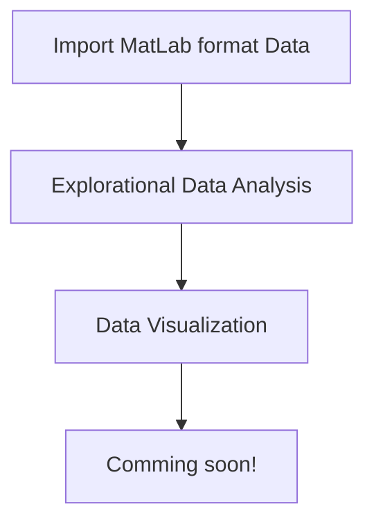

# OpenIE NASA's Mill Data Analysis with R-lang

## Before Running the Rmd files

### Install R, RStudio

[https://posit.co/download/rstudio-desktop/](https://posit.co/download/rstudio-desktop/)

[https://cran.rstudio.com/](https://cran.rstudio.com/)

### Dataset Access

Download the data from this website: [Milling Wear \| NASA Open Data Portal](https://data.nasa.gov/Raw-Data/Milling-Wear/vjv9-9f3x/data) 

Make sure you have put the mill.mat in the same directory with the Rmd files. 

## Workflows for the Mill Dataset Analysis

