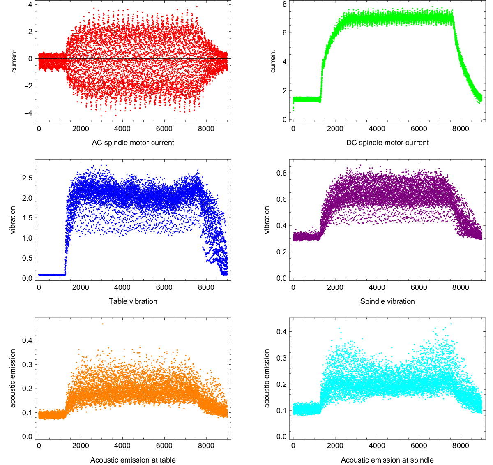

# OpenIE 开源工业工程基金会
[English](../../README.md) | 简体中文
## Project | 基于深度学习的加工中心刀具磨损量预测及其工业应用
### 0x00 写在最前面
本项目起源于2022年，那时候我还在郑州大学（大四）读工业工程，虽然当时项目是新提出的，且里面还有很多不成熟的想法，但是经过好几个月的打磨，也获得了不错的成果（比如在挑战杯比赛中拿到了省级一等奖）。这里特别鸣谢郑州大学管理学院工业工程专业[叶正梗](http://www5.zzu.edu.cn/glgc/info/1134/9317.htm)老师(副研究员)提供给我们的机床数据以及在整个项目中对OpenIE团队的无私指导。<br />
同时感谢团队成员王晓（我的室友，后来去了国防科技大学直博），罗雯杰以及张紫阳。<br />
### 0x01 OpenIE Machine | Mathematica 数据科学
通过机器学习进行加工中心刀具磨损量预测这个项目，与其说是一种在机械电子工程方面的应用，不如说是一种数据科学的研究与探索。工程上需要考虑所采集数据是否符合国际上的标准，部署方面是否具有完善的工具链（比如我经常在Bilibili上面观看[MATLAB中国](https://space.bilibili.com/1768836923?spm_id_from=333.337.0.0)的官方账号视频，从数据获取→数据处理→特征工程→机器学习训练与测试→项目部署在不同设备上，都由专门的Matlab工具箱和程序来完成，虽然非常方便，适合工业界，但在灵活性方面表现不佳，个人感觉难以微调）。<br />
而本项目更多偏向于理论研究，我使用Mathematica以及Wolfram脚本在数据导入，数据处理以及神经网络搭建和测试等方面花费了更多精力。未来可能的工业应用方面将考虑使用Wolfram Engine运行在云端服务器上面，或者通过Mathematica CCodeGenerator将算法模型导出为C function，编译后在目标平台上面运行。
### 0x02 项目导航
通过采集机床信号来推算机床刀具磨损度是一个典型的预测问题，可以通过建立一个机器学习模型来实现。

| Step | Details |
| ---------- | ---------- |
|Step 1 数据收集和准备|确保你已经收集了各种信号数据，包括主轴电流、震动、噪声等，以及对应的刀具磨损量。<br /> 对数据进行清洗，处理缺失值和异常值，确保数据质量。|
| Step 2 特征工程 | 从原始数据中提取有用的特征。这可以包括统计特征（均值、标准差等）、时域特征和频域特征（使用傅里叶变换等）。<br /> 考虑引入领域知识，例如机床工作原理和刀具磨损机制，以帮助选择合适的特征。 |
| Step 3 数据分割 | 将数据集分为训练集和测试集。常见的做法是将大部分数据用于训练，一小部分用于测试模型的性能。|
| Step 4 选择模型 | 由于这是一个预测问题，可以考虑使用回归模型，如线性回归、决策树回归、随机森林等。<br /> 也可以尝试更复杂的模型，例如神经网络，特别是对于复杂的非线性关系。|
| Step 5 模型训练 | 使用训练集对选择的模型进行训练。 <br /> 调整模型的超参数，例如学习率、树的数量等，以获得更好的性能。|
| Step 6 模型评估 | 使用测试集评估模型的性能。常见的评估指标包括均方误差（MSE）、平均绝对误差（MAE）等。 |
| Step 7 模型优化 | 根据评估结果，可能需要对模型进行进一步优化。这可能包括调整特征选择、尝试不同的模型算法、处理数据不平衡等。 |
| Step 8 模型部署和监控 | 一旦满意模型的性能，可以将其部署到生产环境中，并持续监控模型的表现，以确保模型在实际应用中的效果。 |
| Step 9 迭代和改进 | 数据科学是一个迭代的过程。根据实际应用中的反馈，持续优化模型，改进特征工程和模型选择。 |

### 0x03 导入数据/绘制数据图像/数据处理
```mathematica
readMachineSignal[csvFileName_] := Module[{data},
  (*获取当前Notebook文件所在的文件夹地址*)
  currentDirectory = NotebookDirectory[];
  (*构建CSV和DAT文件的完整路径*)
  csvFilePath = 
   FileNameJoin[{currentDirectory, "machineData", csvFileName}];
  data = Import[csvFilePath, "CSV"];
  data
  ]
```
